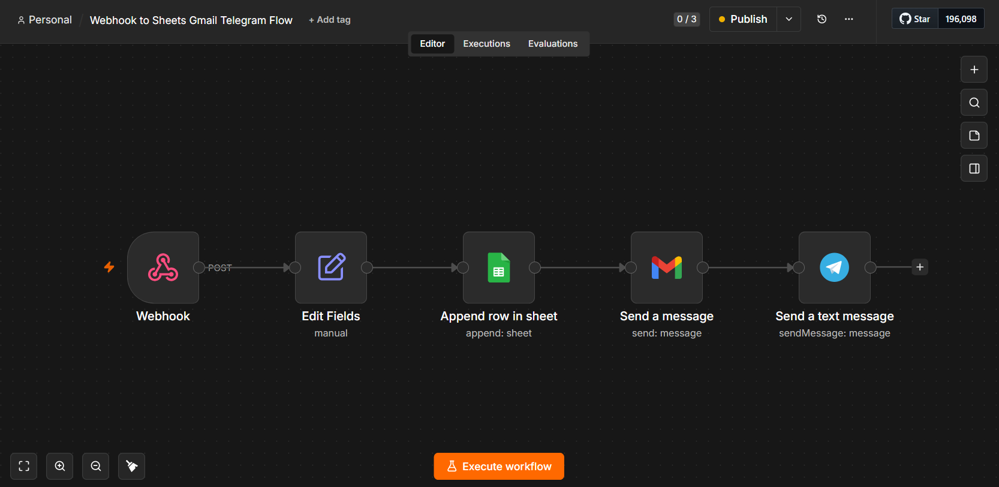

# Instant Lead Response System

Responds to every new lead in under 5 seconds: logs it to Google Sheets,
sends the customer a branded HTML confirmation email, and alerts the
owner on Telegram.

**▶ [Watch the live demo (2 min)](https://youtu.be/ksA84ke4Aoc)**

## The problem
Businesses reply to website leads hours later — by then the lead is cold.

## The flow
Web form → Webhook → Data cleanup → Google Sheets → Branded auto-reply (Gmail) → Telegram alert

## Can be adapted to
Any form (Typeform, WordPress, Webflow) · WhatsApp/Slack/Discord alerts · Any CRM instead of Sheets
